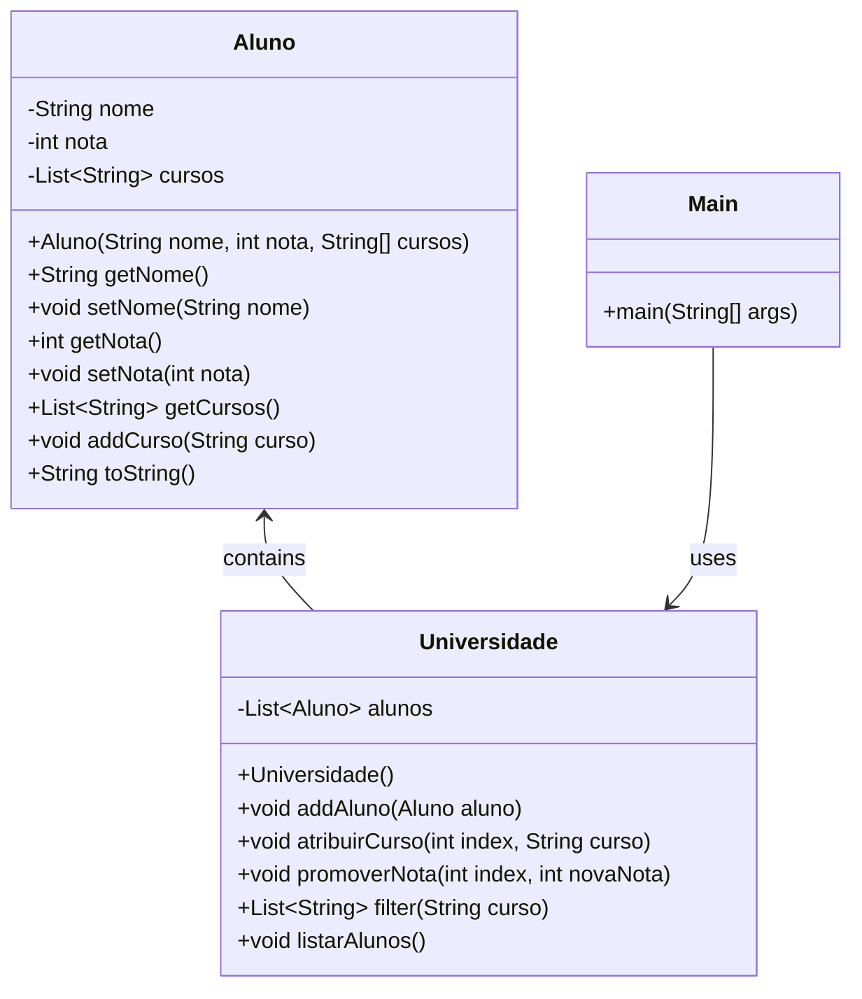

### README.md

```markdown
# Gestão de Alunos da Universidade

## Contexto
Este programa combina programação procedural com programação orientada a objetos para gerenciar informações de alunos em uma universidade. Utilizando conceitos de abstração e encapsulamento, ele permite adicionar alunos, atribuir cursos, promover notas e listar alunos com base em critérios específicos.

## Descrição da Atividade
Implemente a abstração, o encapsulamento de classes e operações simples em uma matriz para implementar os seguintes requisitos:

- Crie uma classe `Aluno` com atributos: nome, nota e uma lista para os cursos atribuídos.
- Adicione modificadores de acesso para que os atributos não sejam acessíveis publicamente, e adicione métodos `set` e `get` para cada um deles.
- Crie uma classe `Universidade`, que inclui como atributo uma lista para os alunos. Implemente as seguintes funcionalidades:
  - Adicionar um novo aluno à lista.
  - Atribuir um novo curso a um aluno.
  - Promover a nota para um aluno.
  - Listar os alunos de um curso.
  - Listar todos os alunos com este formato: `Nome: Raul, Nota: 2, Curso: maths, science, database I`.

## Estrutura do Programa

### Classe `Aluno`
- **Atributos Privados**:
  - `nome`: O nome do aluno.
  - `nota`: A nota do aluno.
  - `cursos`: Uma lista de cursos atribuídos ao aluno.
- **Construtor**:
  - `Aluno(String nome, int nota, String[] cursos)`: Inicializa um aluno com nome, nota e cursos.
- **Métodos Públicos**:
  - `String getNome()`: Retorna o nome do aluno.
  - `void setNome(String nome)`: Define o nome do aluno.
  - `int getNota()`: Retorna a nota do aluno.
  - `void setNota(int nota)`: Define a nota do aluno.
  - `List<String> getCursos()`: Retorna a lista de cursos do aluno.
  - `void addCurso(String curso)`: Adiciona um curso à lista de cursos do aluno.
  - `String toString()`: Retorna uma string representando as informações do aluno.

### Classe `Universidade`
- **Atributos Privados**:
  - `alunos`: Uma lista de objetos `Aluno`.
- **Construtor**:
  - `Universidade()`: Inicializa uma lista de alunos.
- **Métodos Públicos**:
  - `void addAluno(Aluno aluno)`: Adiciona um aluno à lista de alunos.
  - `void atribuirCurso(int index, String curso)`: Atribui um curso a um aluno específico pelo índice.
  - `void promoverNota(int index, int novaNota)`: Promove a nota de um aluno específico pelo índice.
  - `List<String> filter(String curso)`: Retorna uma lista de nomes de alunos inscritos em um curso específico.
  - `void listarAlunos()`: Lista todas as informações dos alunos.

### Classe `Main`
- **Método `main(String[] args)`**:
  - Cria uma instância de `Universidade`.
  - Adiciona instâncias de `Aluno` à universidade.
  - Atribui cursos e promove notas.
  - Lista alunos de um curso específico.
  - Lista todos os alunos com suas informações detalhadas.

## Diagrama de Classes



## Execução do Programa

Ao executar o programa, são realizadas as seguintes operações:

1. Criação de uma instância da classe `Universidade`.
2. Adição de alguns alunos à universidade.
3. Atribuição de um curso a um aluno e promoção da nota de outro aluno.
4. Listagem de alunos que estão matriculados em um curso específico.
5. Listagem de todos os alunos com suas informações detalhadas.